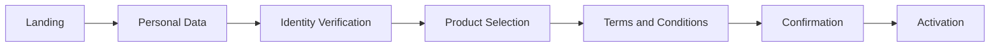
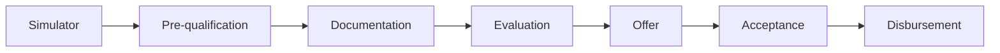

# Experiences and Templates

Dynamic Framework includes a complete collection of pre-designed experiences to accelerate the development of banking and financial solutions. These templates are production-ready and can be customized according to the specific needs of each institution.

## Experience Catalog

### Retail Banking

Retail banking experiences are designed for individual customers and offer intuitive interfaces for daily personal finance management.

#### Available Templates:

**Personal Dashboard**
- Consolidated view of accounts and cards
- Expense and income summary
- Quick access to main functions
- Personalized notifications and alerts

**Account Management**
- Balance and transaction visualization
- Statement downloads
- Alert configuration
- Limit and preference management

**Transfers**
- Transfers between own accounts
- Third-party transfers
- International transfers
- Recurring transfer scheduling

**Bill Payments**
- Catalog of available services
- Payment history
- Scheduled payments
- Favorite services management

**Cards**
- Debit/credit card administration
- Activation and temporary blocking
- Limit configuration
- Transaction visualization

### Corporate Banking

Specialized solutions for corporate clients with complex financial management needs.

#### Available Templates:

**Corporate Dashboard**
- Multi-company view
- Account consolidation
- Projected cash flow
- Key financial indicators

**Treasury Management**
- Global treasury position
- Liquidity management
- Investments and placements
- Financial reports

**Payroll and Mass Payments**
- Payment file uploads
- Multi-level approval
- Processing tracking
- Compliance reports

**Foreign Trade**
- Letters of credit
- Documentary collections
- Bank guarantees
- Operation tracking

**Factoring and Confirming**
- Invoice management
- Financing lines
- Operation statements
- Reports and analysis

### Investments

Experiences designed for investment and wealth management.

#### Available Templates:

**Portfolio Management**
- Consolidated investment view
- Performance analysis
- Asset distribution
- Personalized recommendations

**Trading Platform**
- Instrument buying/selling
- Technical and fundamental analysis
- Scheduled orders
- Transaction history

**Wealth Management**
- Financial planning
- Goal management
- Personalized advisory
- Wealth reports

**Mutual Funds**
- Fund catalog
- Investment simulators
- Subscription and redemption
- Profitability tracking

### Marketing and Onboarding

Experiences focused on customer acquisition and activation.

#### Available Templates:

**Landing Pages**
- Product pages
- Promotional campaigns
- Contact forms
- Product comparisons

**Digital Onboarding**
- Account opening
- Identity verification
- Document upload
- Product activation

**Simulators**
- Mortgage loans
- Personal loans
- Investments
- Insurance

**Help Center**
- Knowledge base
- Frequently asked questions
- Live chat
- Interactive tutorials

## Experience Implementation

### Installing a Template

```bash
# List available templates
npx @modyo/cli@latest list templates

# Install retail banking template
npx @modyo/cli@latest get dynamic-retail-banking my-retail-banking

# Install investments template
npx @modyo/cli@latest get dynamic-investments my-investment-platform
```

### Structure of an Experience

Each template includes:

```
banking-experience/
├── src/
│   ├── views/              # Complete experience views
│   ├── components/         # Reusable components
│   ├── flows/             # Complete user flows
│   ├── services/          # API integrations
│   ├── config/            # Experience configuration
│   └── locales/           # Translations and texts
├── docs/                  # Specific documentation
├── tests/                 # Experience tests
└── .env.example          # Environment variables example
```

### Experience Customization

#### 1. Basic Configuration

```javascript
// src/config/experience.config.js
export const experienceConfig = {
  // Institution information
  institution: {
    name: 'Digital Bank',
    logo: '/assets/logo.svg',
    primaryColor: '#004B8D',
    secondaryColor: '#00A0DF'
  },
  
  // Enabled features
  features: {
    transfers: true,
    investments: true,
    loans: false,
    insurance: false,
    internationalTransfers: true
  },
  
  // API configuration
  api: {
    baseUrl: process.env.REACT_APP_API_URL,
    timeout: 30000,
    retryAttempts: 3
  },
  
  // Business rules
  businessRules: {
    maxTransferAmount: 50000,
    requiresOTPAbove: 1000,
    sessionTimeout: 900000, // 15 minutes
    passwordPolicy: 'strong'
  }
};
```

#### 2. Visual Customization

```scss
// src/styles/custom-theme.scss

// Override theme variables
$primary-color: #004B8D;
$secondary-color: #00A0DF;
$success-color: #28A745;
$danger-color: #DC3545;

// Customize specific components
.df-dashboard {
  &-header {
    background: linear-gradient(135deg, $primary-color 0%, $secondary-color 100%);
    padding: 2rem;
  }
  
  &-card {
    border-radius: 12px;
    box-shadow: 0 4px 6px rgba(0, 0, 0, 0.1);
    
    &:hover {
      transform: translateY(-2px);
      box-shadow: 0 6px 12px rgba(0, 0, 0, 0.15);
    }
  }
}

// Customize specific experiences
.retail-banking {
  .account-card {
    background: white;
    border-left: 4px solid $primary-color;
  }
  
  .quick-action-button {
    border-radius: 50%;
    width: 60px;
    height: 60px;
  }
}
```

#### 3. Feature Extension

```jsx
// src/extensions/CustomTransferFlow.jsx
import React from 'react';
import { TransferFlow } from '@dynamic-framework/experiences';
import { BiometricAuth } from './components/BiometricAuth';
import { FraudDetection } from './services/FraudDetection';

const CustomTransferFlow = () => {
  // Extend base flow with custom features
  return (
    <TransferFlow
      // Add biometric authentication
      authComponent={BiometricAuth}
      
      // Additional validation
      beforeTransfer={async (transferData) => {
        const fraudCheck = await FraudDetection.analyze(transferData);
        if (fraudCheck.risk === 'high') {
          return {
            success: false,
            message: 'Transfer requires additional verification'
          };
        }
        return { success: true };
      }}
      
      // Customize flow steps
      steps={[
        'selectAccounts',
        'enterAmount',
        'biometricAuth', // Custom step
        'enterDetails',
        'confirm',
        'receipt'
      ]}
      
      // Customize messages
      messages={{
        success: 'Your transfer has been processed successfully',
        error: 'We could not process your transfer. Please try again.'
      }}
    />
  );
};

export default CustomTransferFlow;
```

## Experience Composition

Experiences can be combined to create complete solutions:

```jsx
// src/App.jsx
import React from 'react';
import { 
  RetailBankingExperience,
  InvestmentExperience,
  MarketingExperience 
} from '@dynamic-framework/experiences';

const IntegratedBankingApp = () => {
  return (
    <div className="banking-app">
      {/* Landing and onboarding for unauthenticated users */}
      <Route path="/public" component={MarketingExperience} />
      
      {/* Retail banking for personal customers */}
      <ProtectedRoute 
        path="/personal" 
        component={RetailBankingExperience}
        requiredRole="retail"
      />
      
      {/* Integrated investment module */}
      <ProtectedRoute 
        path="/investments" 
        component={InvestmentExperience}
        requiredRole="investor"
      />
      
      {/* Unified experience */}
      <ProtectedRoute path="/dashboard">
        <UnifiedDashboard>
          <RetailBankingExperience.AccountSummary />
          <InvestmentExperience.PortfolioWidget />
          <MarketingExperience.ProductRecommendations />
        </UnifiedDashboard>
      </ProtectedRoute>
    </div>
  );
};
```

## Predefined User Flows

### Account Opening Flow



### Credit Application Flow



## Best Practices

### 1. Experience Selection
- Evaluate your institution's specific needs
- Start with core experiences and expand gradually
- Consider your users' digital maturity

### 2. Customization
- Maintain visual consistency across all experiences
- Adapt flows to your business processes
- Don't modify the framework's core components

### 3. Integration
- Use a unified service layer
- Implement caching to improve performance
- Handle errors consistently

### 4. Maintenance
- Regularly update base templates
- Document all customizations
- Keep tests updated

## Success Stories

### Regional Bank - Digital Transformation
- **Challenge**: Modernize digital channels in 6 months
- **Solution**: Implementation of Retail + Investments experiences
- **Result**: 70% reduction in development time

### Fintech - Quick Launch
- **Challenge**: Launch digital bank in 3 months
- **Solution**: Onboarding template + customized retail banking
- **Result**: Successful launch with 10,000 customers in first month

### Corporate Bank - Enterprise Portal
- **Challenge**: Unify multiple legacy systems
- **Solution**: Enterprise experience with API integrations
- **Result**: 50% improvement in corporate customer satisfaction

## Experience Roadmap

### Coming Soon
- **Open Banking**: External account aggregation
- **Crypto Banking**: Digital asset management
- **Green Banking**: Sustainable financial products
- **Voice Banking**: Voice interactions

### In Development
- Private banking experiences
- Cooperative solutions
- Insurance templates
- Financial education modules

## Support and Resources

- **Experience Documentation**: [dynamic.modyo.com/experiences](https://dynamic.modyo.com/experiences)
- **Live Demos**: [demo.dynamic.modyo.com](https://demo.dynamic.modyo.com)
- **Use Cases**: [dynamic.modyo.com/case-studies](https://dynamic.modyo.com/case-studies)
- **Community**: [community.modyo.com/dynamic](https://community.modyo.com/dynamic)