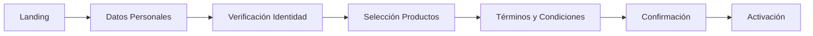
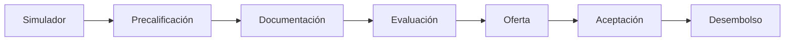

# Experiencias y Plantillas

Dynamic Framework incluye una colección completa de experiencias prediseñadas para acelerar el desarrollo de soluciones bancarias y financieras. Estas plantillas están listas para producción y pueden personalizarse según las necesidades específicas de cada institución.

## Catálogo de Experiencias

### Banca Retail

Las experiencias de banca retail están diseñadas para clientes individuales y ofrecen interfaces intuitivas para la gestión diaria de finanzas personales.

#### Plantillas Disponibles:

**Dashboard Personal**
- Vista consolidada de cuentas y tarjetas
- Resumen de gastos e ingresos
- Accesos rápidos a funciones principales
- Notificaciones y alertas personalizadas

**Gestión de Cuentas**
- Visualización de saldos y movimientos
- Descarga de estados de cuenta
- Configuración de alertas
- Gestión de límites y preferencias

**Transferencias**
- Transferencias entre cuentas propias
- Transferencias a terceros
- Transferencias internacionales
- Programación de transferencias recurrentes

**Pagos de Servicios**
- Catálogo de servicios disponibles
- Historial de pagos
- Pagos programados
- Gestión de servicios favoritos

**Tarjetas**
- Administración de tarjetas de débito/crédito
- Activación y bloqueo temporal
- Configuración de límites
- Visualización de movimientos

### Banca Empresarial

Soluciones especializadas para clientes corporativos con necesidades complejas de gestión financiera.

#### Plantillas Disponibles:

**Dashboard Corporativo**
- Vista multi-empresa
- Consolidación de cuentas
- Flujo de caja proyectado
- Indicadores financieros clave

**Gestión de Tesorería**
- Posición global de tesorería
- Gestión de liquidez
- Inversiones y colocaciones
- Reportes financieros

**Nóminas y Pagos Masivos**
- Carga de archivos de pago
- Aprobación multi-nivel
- Seguimiento de procesamiento
- Reportes de cumplimiento

**Comercio Exterior**
- Cartas de crédito
- Cobranzas documentarias
- Garantías bancarias
- Seguimiento de operaciones

**Factoring y Confirming**
- Gestión de facturas
- Líneas de financiamiento
- Estados de operaciones
- Reportes y análisis

### Inversiones

Experiencias diseñadas para la gestión de inversiones y patrimonio.

#### Plantillas Disponibles:

**Portfolio Management**
- Vista consolidada de inversiones
- Análisis de rendimiento
- Distribución de activos
- Recomendaciones personalizadas

**Trading Platform**
- Compra/venta de instrumentos
- Análisis técnico y fundamental
- Órdenes programadas
- Historial de operaciones

**Wealth Management**
- Planificación financiera
- Gestión de objetivos
- Asesoría personalizada
- Reportes de patrimonio

**Fondos Mutuos**
- Catálogo de fondos
- Simuladores de inversión
- Suscripción y rescate
- Seguimiento de rentabilidad

### Marketing y Onboarding

Experiencias orientadas a la captación y activación de clientes.

#### Plantillas Disponibles:

**Landing Pages**
- Páginas de productos
- Campañas promocionales
- Formularios de contacto
- Comparadores de productos

**Onboarding Digital**
- Apertura de cuentas
- Verificación de identidad
- Carga de documentos
- Activación de productos

**Simuladores**
- Créditos hipotecarios
- Préstamos personales
- Inversiones
- Seguros

**Centro de Ayuda**
- Base de conocimiento
- Preguntas frecuentes
- Chat en vivo
- Tutoriales interactivos

## Implementación de Experiencias

### Instalación de una Plantilla

```bash
# Listar plantillas disponibles
npx @modyo/cli@latest list templates

# Instalar plantilla de banca retail
npx @modyo/cli@latest get dynamic-retail-banking mi-banca-retail

# Instalar plantilla de inversiones
npx @modyo/cli@latest get dynamic-investments mi-plataforma-inversiones
```

### Estructura de una Experiencia

Cada plantilla incluye:

```
experiencia-bancaria/
├── src/
│   ├── views/              # Vistas completas de la experiencia
│   ├── components/         # Componentes reutilizables
│   ├── flows/             # Flujos de usuario completos
│   ├── services/          # Integraciones con APIs
│   ├── config/            # Configuración de la experiencia
│   └── locales/           # Traducciones y textos
├── docs/                  # Documentación específica
├── tests/                 # Tests de la experiencia
└── .env.example          # Variables de entorno ejemplo
```

### Personalización de Experiencias

#### 1. Configuración Básica

```javascript
// src/config/experience.config.js
export const experienceConfig = {
  // Información de la institución
  institution: {
    name: 'Banco Digital',
    logo: '/assets/logo.svg',
    primaryColor: '#004B8D',
    secondaryColor: '#00A0DF'
  },
  
  // Funcionalidades habilitadas
  features: {
    transfers: true,
    investments: true,
    loans: false,
    insurance: false,
    internationalTransfers: true
  },
  
  // Configuración de APIs
  api: {
    baseUrl: process.env.REACT_APP_API_URL,
    timeout: 30000,
    retryAttempts: 3
  },
  
  // Reglas de negocio
  businessRules: {
    maxTransferAmount: 50000,
    requiresOTPAbove: 1000,
    sessionTimeout: 900000, // 15 minutos
    passwordPolicy: 'strong'
  }
};
```

#### 2. Personalización Visual

```scss
// src/styles/custom-theme.scss

// Sobrescribir variables del tema
$primary-color: #004B8D;
$secondary-color: #00A0DF;
$success-color: #28A745;
$danger-color: #DC3545;

// Personalizar componentes específicos
.df-dashboard {
  &-header {
    background: linear-gradient(135deg, $primary-color 0%, $secondary-color 100%);
    padding: 2rem;
  }
  
  &-card {
    border-radius: 12px;
    box-shadow: 0 4px 6px rgba(0, 0, 0, 0.1);
    
    &:hover {
      transform: translateY(-2px);
      box-shadow: 0 6px 12px rgba(0, 0, 0, 0.15);
    }
  }
}

// Personalizar experiencias específicas
.retail-banking {
  .account-card {
    background: white;
    border-left: 4px solid $primary-color;
  }
  
  .quick-action-button {
    border-radius: 50%;
    width: 60px;
    height: 60px;
  }
}
```

#### 3. Extensión de Funcionalidades

```jsx
// src/extensions/CustomTransferFlow.jsx
import React from 'react';
import { TransferFlow } from '@dynamic-framework/experiences';
import { BiometricAuth } from './components/BiometricAuth';
import { FraudDetection } from './services/FraudDetection';

const CustomTransferFlow = () => {
  // Extender el flujo base con funcionalidades propias
  return (
    <TransferFlow
      // Agregar autenticación biométrica
      authComponent={BiometricAuth}
      
      // Validación adicional
      beforeTransfer={async (transferData) => {
        const fraudCheck = await FraudDetection.analyze(transferData);
        if (fraudCheck.risk === 'high') {
          return {
            success: false,
            message: 'Transferencia requiere verificación adicional'
          };
        }
        return { success: true };
      }}
      
      // Personalizar pasos del flujo
      steps={[
        'selectAccounts',
        'enterAmount',
        'biometricAuth', // Paso personalizado
        'enterDetails',
        'confirm',
        'receipt'
      ]}
      
      // Personalizar mensajes
      messages={{
        success: 'Tu transferencia ha sido procesada exitosamente',
        error: 'No pudimos procesar tu transferencia. Intenta nuevamente.'
      }}
    />
  );
};

export default CustomTransferFlow;
```

## Composición de Experiencias

Las experiencias pueden combinarse para crear soluciones completas:

```jsx
// src/App.jsx
import React from 'react';
import { 
  RetailBankingExperience,
  InvestmentExperience,
  MarketingExperience 
} from '@dynamic-framework/experiences';

const IntegratedBankingApp = () => {
  return (
    <div className="banking-app">
      {/* Landing y onboarding para usuarios no autenticados */}
      <Route path="/public" component={MarketingExperience} />
      
      {/* Banca retail para clientes personas */}
      <ProtectedRoute 
        path="/personal" 
        component={RetailBankingExperience}
        requiredRole="retail"
      />
      
      {/* Módulo de inversiones integrado */}
      <ProtectedRoute 
        path="/investments" 
        component={InvestmentExperience}
        requiredRole="investor"
      />
      
      {/* Experiencia unificada */}
      <ProtectedRoute path="/dashboard">
        <UnifiedDashboard>
          <RetailBankingExperience.AccountSummary />
          <InvestmentExperience.PortfolioWidget />
          <MarketingExperience.ProductRecommendations />
        </UnifiedDashboard>
      </ProtectedRoute>
    </div>
  );
};
```

## Flujos de Usuario Predefinidos

### Flujo de Apertura de Cuenta



### Flujo de Solicitud de Crédito



## Mejores Prácticas

### 1. Selección de Experiencias
- Evalúa las necesidades específicas de tu institución
- Comienza con experiencias core y expande gradualmente
- Considera la madurez digital de tus usuarios

### 2. Personalización
- Mantén la consistencia visual en todas las experiencias
- Adapta los flujos a tus procesos de negocio
- No modifiques los componentes core del framework

### 3. Integración
- Usa una capa de servicios unificada
- Implementa caché para mejorar performance
- Maneja errores de manera consistente

### 4. Mantenimiento
- Actualiza regularmente las plantillas base
- Documenta todas las personalizaciones
- Mantén tests actualizados

## Casos de Éxito

### Banco Regional - Transformación Digital
- **Desafío**: Modernizar canales digitales en 6 meses
- **Solución**: Implementación de experiencias Retail + Inversiones
- **Resultado**: 70% reducción en tiempo de desarrollo

### Fintech - Lanzamiento Rápido
- **Desafío**: Lanzar banco digital en 3 meses
- **Solución**: Plantilla de onboarding + banca retail personalizada
- **Resultado**: Lanzamiento exitoso con 10,000 clientes en primer mes

### Banco Corporativo - Portal Empresarial
- **Desafío**: Unificar múltiples sistemas legacy
- **Solución**: Experiencia empresarial con integraciones API
- **Resultado**: 50% mejora en satisfacción de clientes corporativos

## Roadmap de Experiencias

### Próximamente
- **Open Banking**: Agregación de cuentas externas
- **Cripto Banking**: Gestión de activos digitales
- **Green Banking**: Productos financieros sostenibles
- **Voice Banking**: Interacciones por voz

### En Desarrollo
- Experiencias para banca privada
- Soluciones para cooperativas
- Plantillas para seguros
- Módulos de educación financiera

## Soporte y Recursos

- **Documentación de Experiencias**: [dynamic.modyo.com/experiences](https://dynamic.modyo.com/experiences)
- **Demos en Vivo**: [demo.dynamic.modyo.com](https://demo.dynamic.modyo.com)
- **Casos de Uso**: [dynamic.modyo.com/case-studies](https://dynamic.modyo.com/case-studies)
- **Comunidad**: [community.modyo.com/dynamic](https://community.modyo.com/dynamic)